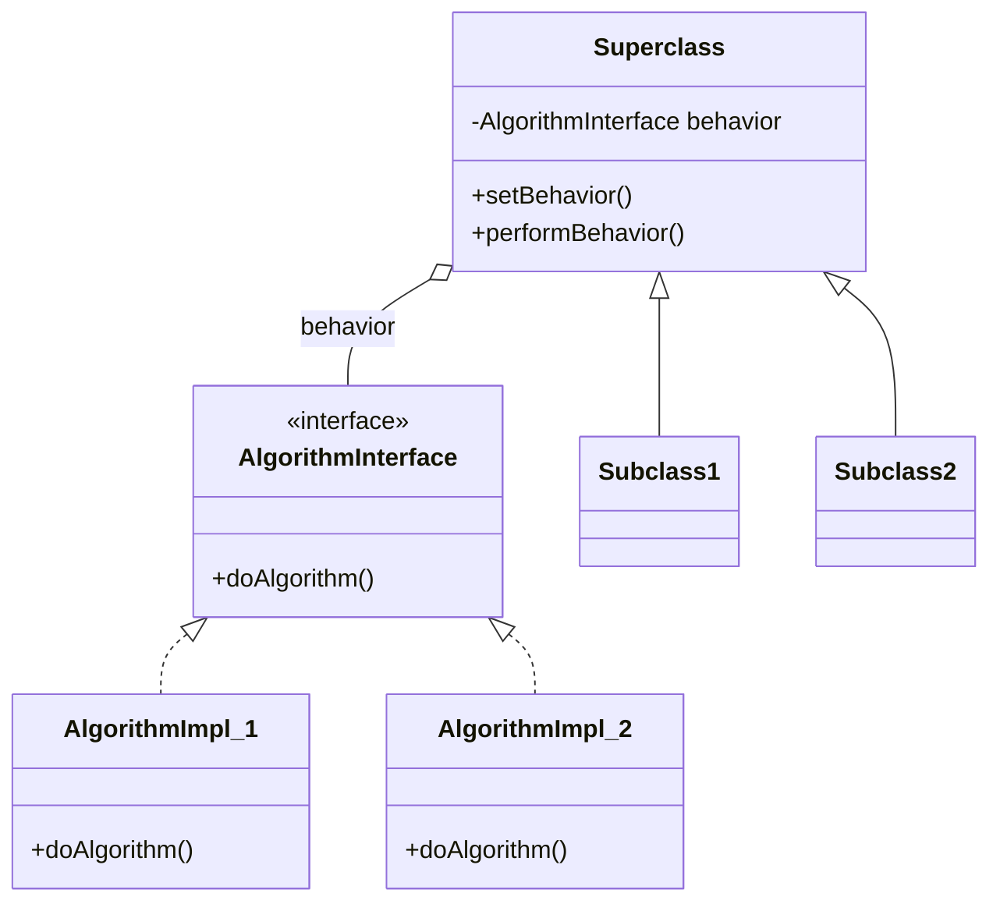
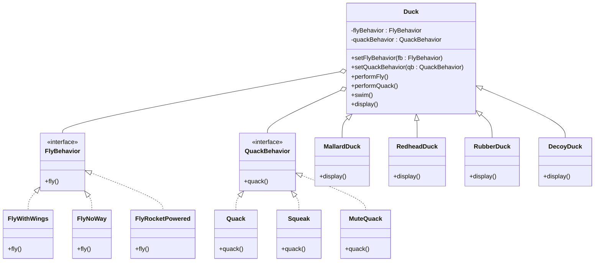

# Section 2 — The Strategy Pattern

> Course chapter: **The Strategy Pattern** (lectures 2.1 → 2.11)
> Source: Programming Foundations: Design Patterns (Java) → applied in TypeScript.

This chapter builds the Strategy pattern step by step — starting from a naive
inheritance design, exposing its cracks, and arriving at a flexible
composition-based solution. We document each lecture as we discuss it.

---

## 1. Revisiting inheritance

> Course module: **Revisiting inheritance** (2.1)

### Inheritance: the appealing shortcut

Inheritance is the first OOP tool most of us reach for, and it *feels* powerful.
You define a base class with shared behavior, then subclasses automatically get
all of it for free and override just the bits that differ. It promises **reuse
without duplication**.

In the course's Duck example (Java), it looks like this:

```
        Duck                    ← base class: swim(), display(), quack(), fly()
       /   |   \    \
Mallard Redhead Rubber Decoy    ← subclasses override display(), maybe quack()/fly()
```

At first glance this is elegant: `MallardDuck` and `RedheadDuck` get `swim()`
for free and only override `display()`. Job done, right?

This is why inheritance is seductive: it works *beautifully* for the first few
cases. The trouble only appears later, when requirements change.

### The "all IS-A" warning sign

The instructor's key warning: **when all your class relationships are IS-A,
take a closer look — overusing inheritance produces inflexible designs.**

Why? Because IS-A (inheritance) is a **very strong, very rigid** relationship.
When subclass B `extends` class A:

- B is **permanently bound** to A — you can't change that at runtime.
- B inherits **everything** A has — public methods, protected fields, the lot —
  whether B wants it or not.
- B is **defined by what A is**, not by what B *does*.

IS-A says *"B is a kind of A, forever, in every respect."* That's a huge claim.
And when *every* relationship in your design is IS-A, you've built a rigid tree
where each leaf is locked into the behavior of its ancestors.

Contrast with HAS-A (composition): *"B *holds* an A, and can swap it, replace
it, or drop it at any time."* Far more flexible. (Covered later in this chapter:
"Why HAS-A is better than IS-A".)

### Why overuse makes designs inflexible — the Duck cracks

The base `Duck` gives every subclass `quack()` and `fly()`. As duck types
diversify:

- **RubberDuck** — shouldn't fly, squeaks instead of quacks → override `fly()`
  to a no-op, `quack()` to squeak.
- **DecoyDuck** — shouldn't fly *or* quack → override both to no-ops.
- **WoodenDecoyDuck** — same, override both again.

See the rot: every new "weird" duck forces you to **override behavior just to
disable it**. You're not *adding* behavior — you're *fighting* the base class to
take behavior away. That's the smell:

> **When you spend more time disabling inherited behavior than using it,
> inheritance is the wrong tool.**

And it gets worse across two axes:

**a) Code duplication.** Suppose 6 duck species share a "can't fly" need. With
inheritance, you override `fly()` to a no-op *six times*. Want to change what
"can't fly" means (say, log "I can't fly")? You edit six classes. There's no
single place where "flightless" lives.

**b) Accidental behavior.** A new duck subclass that *forgets* to override
`fly()` suddenly gains flight. The bug is silent — the compiler is happy, the
duck just wrongly flies. Inheritance makes wrong behavior the *default* you must
remember to turn off, rather than behavior you opt into.

### The deeper issue: inheritance entangles *what varies* with *what stays the same*

Connection back to Chapter 1's **"Encapsulate what varies."** Inheritance
*violates* it.

In the Duck tree:
- **Stays the same:** `swim()`, `display()` structure.
- **Varies:** quacking behavior, flying behavior.

But inheritance **bundles both into one class**. The varying quack/fly lives
*inside* the same class as the stable swim. So every time the *varying* part
changes, you touch the class that also owns the *stable* part. There's no
boundary between them — exactly what "encapsulate what varies" told us to avoid,
and inheritance, by its nature, refuses to draw that boundary.

> **Takeaway:** Inheritance is great for sharing *truly stable, universal*
> behavior, but the moment behavior *varies* across subclasses, IS-A ties that
> variation to the stable parts and makes the whole design rigid.

### Java → TypeScript bridge

The course's Java `Duck extends` hierarchy maps directly to TypeScript's
`class Duck { ... }` / `class MallardDuck extends Duck { override ... }` — same
syntax family, same rigidity. The IS-A warning applies identically. We'll see
the TS code once we reach the *solution* (Strategy); here we are still
diagnosing the *problem*, which is language-neutral.

---

## 2. Limitations of inheritance

> Course module: **Limitations of inheritance** (2.2)

### Limitation 1 — The ripple effect (headline limitation)

Add `fly()` to the base `Duck` class → **every** duck suddenly flies, including
the rubber duck and decoy that shouldn't. So you have to hunt down every wrong
duck and override `fly()` to a no-op. One change in one place breaks many places.

> **This is backwards.** Good design wants changes to stay local. Inheritance
> makes a base-class change *ripple outward* to every descendant — including
> leaves that have nothing to do with the new feature. The compiler won't warn
> you; the rubber duck will just quietly start flying.

### Limitation 2 — Behavior is locked in at class-identity time (runtime inflexibility)

A `MallardDuck` quacks because *it's a MallardDuck*. You can't make it stop
quacking, or give a decoy a temporary quack, without creating a whole new class.
Behavior is glued to the class forever. To change behavior, you have to change
*which object you are* — far too coarse.

### Limitation 3 — No selective reuse of a single behavior

Want "flightless" for 6 ducks? You write the no-fly override 6 times. Want to
change what "can't fly" means later? Edit 6 classes. There's no single place
where "flightless" lives — because the behavior is glued inside the class.

### Limitation 4 — The base class becomes a junk drawer

`Duck` owns `swim`, `quack`, `fly`, and more. Every subclass inherits all of
it, wanted or not. Most subclasses spend their time *turning off* behavior they
never asked for. The base class knows too much and changes too riskily.

### The root cause in one line

> **Inheritance fuses behavior to class identity — so behavior can only change
> by picking a different class, and every base-class change automatically hits
> every descendant.**

### Java → TypeScript bridge

Same rigidity in TS: `class MallardDuck extends Duck` has identical behavior
(and identical limitations). The IS-A warning applies identically. We're still
diagnosing the *problem* here; we'll write the TS code once we reach the
*solution* (Strategy).

---

## 3. Trying interfaces

> Course module: **Trying interfaces** (2.3)

### What is an interface?

Conceptually (language-agnostic), an **interface is a contract**. It says:

> "To be considered an X, you must provide these methods."

It specifies **what** a type can do, not **how** it does it. It lists the
*capability* without the *implementation*. Key properties:

- **No implementation** — an interface has method *signatures* but no method
  *bodies*. It can't hold code or state.
- **A type, not a class** — any object whose shape matches the interface is
  considered that type.
- **Substitutability** — if a function expects an interface type, any object
  that implements it can be passed in. The caller never knows the concrete class.

Analogy: a **job description**. "A Driver must be able to `drive()`." It
doesn't care *how* you drive (stick, automatic, truck) or *who* you are (taxi,
bus, courier). Anyone who fulfills the contract can be hired as a Driver.

### Interfaces in TypeScript (Java → TS bridge)

TypeScript interfaces are **structural** (shape-based), not **nominal**
(name-based) like Java. Any object whose *shape* matches an interface is
automatically that type — even if it never explicitly declares `implements`.

```ts
// The contract (a shape)
interface Flyable {
  fly(): void;
}

// A class explicitly implementing it
class MallardDuck implements Flyable {
  fly(): void {
    // implementation
  }
}

// An object that just HAPPENS to fit — no "implements" needed
const thing: Flyable = {
  fly() {
    // works! it has the right shape
  },
};
```

TypeScript specifics worth knowing now:

- **`interface` vs `type`** — both describe object shapes. `interface` is the
  classic OOP contract and is extendable; `type` is more flexible (unions,
  primitives) but for plain object contracts they're interchangeable. We'll
  mostly use `interface` to mirror the course's Java intent.
- **No runtime existence** — TS interfaces are **erased** at compile time. They
  exist only for type-checking, never at runtime.
- **First-class functions** — a single-method interface is often better
  expressed as a **function type** (`type QuackBehavior = () => void`). We'll
  compare both when we build the solution.
- **`implements` is optional but useful** — declaring `class X implements Y`
  makes the compiler *check* that X satisfies Y. Without it, X is still
  assignable to Y if its shape fits, but you lose explicit verification.

The core idea — *a contract for capability, separate from implementation* — is
identical to Java. TS just makes it lighter and structural.

### The "let's use interfaces" design — and why it also fails

Pull `fly()` and `quack()` into interfaces, so only ducks that actually can
fly/quack implement them:

```
Duck (base: swim(), display())
   │
   ├─ MallardDuck   implements Flyable, Quackable
   ├─ RedheadDuck   implements Flyable, Quackable
   ├─ RubberDuck                    implements Quackable
   └─ DecoyDuck                     (neither)
```

**On paper this looks like progress:** the rubber duck no longer inherits
`fly()` — only implementers get the obligation. The "accidental flying" bug
seems solved.

### Three fatal problems

**1. It destroys code reuse.** An interface has **no implementation** — only
the signature. So when `MallardDuck implements Flyable`, it must write its own
`fly()` body. When `RedheadDuck implements Flyable`, it must also write its own
`fly()` body. Same for every flying duck.

> As the instructor says: *"Imagine 20, 30, or 40 ducks; every single duck will
> have to implement its own fly and quack methods."*

You've traded one evil for another. Inheritance gave you reuse but forced
behavior on everyone; interfaces give you control but **remove all reuse**. 20
copies of the same logic will drift apart over time.

**2. Maintenance nightmare.** Change the flying behavior (add a sound effect on
takeoff, log something)? Because the `fly()` implementation is duplicated in
*every* flying duck, you must **edit every single class**. One behavior change
→ 20 edits, and you'd better not miss one.

**3. Still no runtime changes.** A duck's flying/quacking is decided by which
interfaces its class declares — i.e., by its *type at class-definition time*. A
`MallardDuck` is `Flyable` forever; you can't make it stop flying at runtime,
or give a `DecoyDuck` a temporary quack. The behavior is still fused to the
class's declared type. We've moved the *rigidity*, not removed it.

### Two dead ends — one diagnosis

| Approach | Reuse? | Right behavior per duck? | Runtime change? |
|---|---|---|---|
| Inheritance (2.1–2.2) | ✅ yes (too much — forced) | ❌ no (rubber flies) | ❌ no |
| Interfaces (2.3) | ❌ no (each duck rewrites it) | ✅ yes (only implementers get it) | ❌ no |

The common failure: **both keep behavior tied to the class/type itself.** The
solution (coming in the next lectures) will let behavior live in **its own
objects**, which a duck *holds* (HAS-A) rather than *is* (IS-A) or *declares*
(implements).

---

_Status: documented after our discussion of lectures 2.1–2.3. Next lecture:
**2.4 — Get inspiration from design principles**._

---

## 4. Get inspiration from design principles

> Course module: **Get inspiration from design principles** (2.4)

### Back to "Encapsulate what varies"

The principle says: *identify the aspects that vary and separate them from what
stays the same.* The instructor's framing: *"if you find yourself altering the
flying and quacking code every time you add a new kind of duck, those are the
parts that are changing — and they need to be pulled OUT."*

**The payoff:** once you separate out the parts that are frequently changing,
you can modify those parts **without affecting the rest of your code**. The
behavior now lives *somewhere else*, so changing it touches only that place,
never the ducks.

So principle #1 answers **where** the behavior should live (outside the duck).
It leaves a second question unanswered: **how does the duck *talk to* that
separated behavior?** That's what principle #2 answers.

### "Supertype" — what does it mean?

A **supertype** is a type that sits **above** another type in the type
hierarchy — the more general, more abstract type that a concrete type *derives
from* (via inheritance) or *conforms to* (via an interface).

In Java/OOP there are two flavors of supertype:

- A **superclass** — a class you `extend`. (`Duck` is the supertype of `MallardDuck`)
- An **interface** — a contract you `implements`. (`Flyable` is the supertype of anything that implements it)

The instructor says *"the interface is supertype"* because in this design the
interface plays the supertype role:

```
        Flyable  (interface — the SUPERTYPE)
       /    |    \\
  FlyWith  FlyNo  FlyRocket   (concrete classes — the IMPLEMENTATIONS)
  Wings    Way    Powered
```

`Flyable` is the supertype; `FlyWithWings`, `FlyNoWay`, `FlyRocketPowered` are
its subtypes (concrete implementations). The supertype is the **abstraction**;
the subtypes are the **concrete choices**.

> **Supertype** = the general, abstract type you can refer to.
> **Implementation** = a specific, concrete class that fulfills that contract.

---

## 5. "Program to an interface, not an implementation"

> Course module: **Program to an interface** (2.5)

### The one-line meaning

> **Always refer to objects by their *interface* type (the abstraction), never
> by their concrete class* type (the implementation).**

### What is "an implementation"?

An **implementation** is a *specific, concrete class* — the actual code that
does the work, instantiated with `new`.

Examples: `FlyWithWings`, `FlyNoWay`, `FlyRocketPowered`.

### What is "an interface"?

An **interface** is the *abstraction above* those implementations — the contract
they all share. It says *"anything that can fly has a `fly()` method"* without
saying *how*.

### "Programming to an implementation" — the BAD way

Your code holds a variable typed as the **concrete class**:

```ts
// ❌ BAD — locked to FlyWithWings forever
const flyer: FlyWithWings = new FlyWithWings();
flyer.fly();
```

What's wrong? `flyer` is declared as `FlyWithWings`. It can **only ever** hold
a `FlyWithWings` object. If you later want rockets instead, you can't — the
type is locked. You'd have to change the variable's type and edit **every line**
that depends on `flyer` being a `FlyWithWings`. You've tied yourself to one
specific implementation.

### "Programming to an interface" — the GOOD way

Your code holds a variable typed as the **interface**:

```ts
// ✅ GOOD — typed as the abstraction
let flyer: Flyable = new FlyWithWings();
flyer.fly();

// Later — swap to any implementation, NO other code changes:
flyer = new FlyRocketPowered();
flyer.fly();
```

Now `flyer` is declared as `Flyable`. It can hold **any** object that
implements `Flyable`. To change the behavior, you just assign a different
object. The rest of your code only ever calls `flyer.fly()` — it never cares
*which* implementation is inside. **You've decoupled the code from the specific
behavior.**

> Important: in the standalone example above, use `let` (not `const`) so the
> variable can be reassigned. `const` locks the *binding* — you cannot point it
> to a different object later.

In OOP (the Strategy pattern), the typical form is **mutating a property** on
an object:

```ts
class Duck {
  flyBehavior: Flyable;  // ← property typed as the interface

  constructor() {
    this.flyBehavior = new FlyWithWings();
  }

  performFly(): void {
    this.flyBehavior.fly();   // delegates — doesn't care which impl
  }

  setFlyBehavior(fb: Flyable): void {
    this.flyBehavior = fb;    // ✅ swap at runtime — the duck stays the same
  }
}

const duck = new Duck();           // const is fine — we're mutating a property
duck.performFly();                 // "I'm flying with wings!"

duck.setFlyBehavior(new FlyRocketPowered());
duck.performFly();                 // "I'm flying with rockets!"
```

Here `const duck` is fine because we're **mutating a property** on the object,
not reassigning the variable. The object identity never changes; only its
internal `flyBehavior` pointer does.

### The intuition: the power outlet analogy

Think of a **wall power outlet**:

- The **outlet shape** is the *interface*. It defines a contract: "anything
  that plugs in here must have these two prongs."
- The **appliance** is the *implementation*. A toaster, a phone charger, a lamp
  — each is a concrete device.

When you "program to an interface," you treat the outlet as *"something I can
plug into."* You don't care whether a toaster or a lamp is plugged in — you
just know *it can draw power*. You can **swap** the appliance freely because
your expectations are about the *outlet's contract*, not the *specific device*.

When you "program to an implementation," it's as if the wall were **hard-wired
to a toaster** — you could never swap it for a lamp without rewiring the wall.
That's how rigid concrete-type references are.

### How both principles together answer our duck problem

| Principle | Tells us… | Applied to ducks |
|---|---|---|
| **Encapsulate what varies** | Pull changing parts *out* into their own things | Flying & quacking become **separate classes** |
| **Program to an interface** | Refer to those parts by their *interface* (supertype) | `Duck` holds `Flyable` and `Quackable`, not `FlyWithWings` |

Combine them and the design forces itself into the right shape:

```
      Duck (base — holds behaviors, doesn't own them)
         │
         ├── flyBehavior   : Flyable    ← interface (supertype)
         └── quackBehavior : Quackable  ← interface (supertype)
                    ▲
                    │ implements
        ┌───────────┼────────────┐
   FlyWithWings  FlyNoWay  FlyRocketPowered   ← concrete behavior classes
```

- The duck **HAS-A** flying behavior (holds it as a property) — not **IS-A** flyer.
- The duck talks to the behavior through the **interface** — it never knows *how* it flies.
- You can **swap behaviors at runtime** — `duck.setFlyBehavior(new FlyRocketPowered())`.
- Each behavior lives in **one place** — change flying once, all ducks pick it up.

### Summary table

| | Programming to an **implementation** ❌ | Programming to an **interface** ✅ |
|---|---|---|
| Variable type | Concrete class (`FlyWithWings`) | Interface (`Flyable`) |
| Can hold different behaviors? | No — locked to one class | Yes — any implementation of `Flyable` |
| Swapping behavior | Requires editing code everywhere | Just assign a new object |
| Coupling | Tight — tied to a specific class | Loose — tied only to a contract |
| Runtime change | Impossible | Easy |

---

## Key terms

- **Design principle** — a general guideline for good OO design (e.g.,
  "encapsulate what varies," "program to an interface").
- **Encapsulate what varies** — identify aspects that change and separate them
  from what stays the same; the first principle that motivates Strategy.
- **Program to an interface, not an implementation** — refer to objects by their
  abstraction (interface) so you can swap concrete behavior underneath without
  touching the code that uses it; the second principle that motivates Strategy.
- **Supertype** — a general/abstract type (interface or superclass) that
  concrete classes conform to or derive from; used as the reference type.
- **Implementation** — a specific, concrete class that provides the actual
  behavior; the thing you *don't* want your code tied to.
- **Structural typing** — TypeScript's system where types are compatible if
  their shapes match, regardless of explicit interface declarations.

---

## 6. Exploring the Strategy pattern

> Course module: **Exploring the strategy pattern** (2.7)

### The official definition (GoF)

> **The Strategy Pattern defines a family of algorithms, encapsulates each
> one, and makes them interchangeable. The algorithm can vary independently
> from the clients that use it.**

This is the Gang of Four definition — the shared vocabulary. Let's break it
apart phrase by phrase.

### Phrase 1 — "a family of algorithms"

"Algorithm" here doesn't mean a sorting algorithm. It means *a way of doing
something* — a behavior, a strategy, an approach. In the duck world:

- "fly with wings" is an algorithm
- "fly with a rocket" is an algorithm
- "can't fly" is an algorithm
- "quack loudly" is an algorithm
- "squeak" is an algorithm

"Family" means these are all variations of the *same* capability. They're
siblings — they all answer the same question ("how do you fly?") with different
answers. They share a contract (the interface), but each implements it
differently.

So **"a family of algorithms"** = a set of interchangeable ways to do one
specific thing.

```
Family of "fly" algorithms:    Family of "quack" algorithms:
  FlyWithWings                   Quack
  FlyNoWay                       Squeak
  FlyRocketPowered               MuteQuack
  (all implement FlyBehavior)    (all implement QuackBehavior)
```

### Phrase 2 — "encapsulates each one"

"Encapsulates" has two meanings here, and both matter:

1. **Wrapped in its own class** — each algorithm lives inside its own concrete
class (`FlyWithWings`, `FlyNoWay`, etc.). It's not scattered across the duck
hierarchy. It's not duplicated. It has **one home**.

2. **Hidden behind an interface** — the outside world doesn't see the concrete
class. It only sees the interface (`FlyBehavior`). The *how* is hidden; only
the *what* is exposed.

This is exactly the "encapsulate what varies" principle — **each varying
behavior gets pulled out and sealed inside its own capsule.**

The payoff: **each algorithm can change without affecting anything else.** Want
to change what "fly with wings" prints? Edit `FlyWithWings` only. No duck is
touched. No other behavior is touched.

### Phrase 3 — "makes them interchangeable"

Because all algorithms in a family share the same interface, they're
**plug-compatible**. You can swap one for another at any time, and the code
using them doesn't notice.

This is where "program to an interface" pays off. The duck holds a
`FlyBehavior` (the interface), so it can hold **any** concrete implementation.
Swapping is just:

```
flyBehavior = new FlyRocketPowered();   // swap — one line
```

No `if` statements. No `switch`. No editing the duck. Just **replace the
object**.

This interchangeability is what enables **runtime changes** — the thing
inheritance and interfaces-alone couldn't do.

### Phrase 4 — "the algorithm can vary independently from the clients that use it"

"Client" = the code that *uses* the algorithm. In our case, the `Duck` class
is the client of `FlyBehavior`. The duck *calls* `flyBehavior.fly()` but
doesn't *know* how flying works.

"Vary independently" means:

- You can add a new flying algorithm (`FlyWithJetPack`) **without touching
  `Duck`**.
- You can change an existing algorithm (`FlyWithWings` now logs a message)
  **without touching `Duck`**.
- You can change `Duck` (add a new method, a new subclass) **without touching
  any flying algorithm**.

**The two sides evolve separately.** That's *independence*. The algorithms and
their clients are **decoupled** — connected only by the thin contract of the
interface.

This is the opposite of inheritance, where changing the base class ripples to
every descendant. Here, the behavior and the client are on **opposite sides of
an interface**, and the interface is the only bridge.

### How the definition maps to our duck design

| Definition phrase | In the duck design |
|---|---|
| "a family of algorithms" | `FlyWithWings`, `FlyNoWay`, `FlyRocketPowered` — all the fly behaviors |
| "encapsulates each one" | each in its own class, behind the `FlyBehavior` interface |
| "makes them interchangeable" | duck holds a `FlyBehavior`, can swap any for any other |
| "algorithm varies independently from clients" | add/change a fly behavior without touching `Duck`; change `Duck` without touching fly behaviors |

### The two superpowers

1. **Adaptability (flexibility)** — behaviors can be swapped at runtime. The
model duck starts flightless and gets a rocket mid-program. No recompilation,
no new class.

2. **Reusability + independence** — a behavior is a self-contained unit.
`FlyWithWings` can be reused by *any* duck, *and* can be changed without
breaking any duck. The behavior and the duck don't know about each other's
internals.

### The one-line mental model

> **Strategy = pull the varying behavior out into its own swappable objects,
> talk to them through an interface, so behavior and client can change without
> breaking each other.**

---

## 7. The generic Strategy class diagram

> Course module: **Exploring the strategy pattern** (continued)

The Strategy pattern has **three players** and **two relationships** between
them. Understanding this skeleton means you understand *every* Strategy
implementation, not just ducks.

### The three players

**Player 1 — The Strategy Interface (the contract).**

This is the **abstraction**. It defines a single method — `doAlgorithm()` —
that says *"any strategy must be able to do this,"* but says nothing about
*how*.

Think of it as a **job description**: "we need someone who can
`doAlgorithm()`." It doesn't care who fills the role or how they do it.

**Player 2 — The Concrete Strategies (the implementations).**

These are the **actual behaviors** — the real, instantiated code. Each one
implements the interface and provides its own version of `doAlgorithm()`.

- `AlgorithmImpl_1` does the algorithm one way.
- `AlgorithmImpl_2` does it another way.

They're **siblings**, not parent/child. They don't know about each other.
They only share the contract. You can add a third, a fourth, a fifth — none
of the others change.

**Player 3 — The Context (the superclass).**

This is the **object that needs the behavior**. It has two things:

1. **A field** typed as the interface — it *holds* a strategy (composition).
2. **A method** that delegates to the strategy — it *uses* the behavior
   without knowing how it works.

The context also exposes a **setter** so the strategy can be swapped at
runtime.

In the duck world: `Duck` is the context, `flyBehavior` is the field,
`performFly()` is the delegating method, and `setFlyBehavior()` is the setter.

### The two relationships

**Relationship 1 — Realization (interface → concrete strategies).**

The concrete strategies **implement** the interface.

**Meaning:** each concrete class *promises* to fulfill the contract. The
interface is their **supertype**. Code that depends on the interface can use
*any* of them interchangeably.

This is **"program to an interface"** in action — the interface is the only
thing anyone references.

**Relationship 2 — Composition (context → interface).**

The context **holds** a reference to the interface.

**Meaning:** the context *has-a* strategy. It doesn't *inherit* the strategy
(that would be IS-A). It **contains** it (HAS-A). The strategy is a
**separate object living inside** the context.

This is **"favor composition over inheritance"** in action.

**Relationship 3 — Inheritance (superclass → subclasses).**

The subclasses **extend** the superclass.

**Meaning:** inheritance is *still used*, but **only for the parts that
genuinely belong to the type hierarchy** (like `display()`). The varying
behavior is NOT inherited — it's composed.

This is the hybrid: **inheritance for stable structure, composition for
varying behavior.**

### The delegation flow

1. Someone calls `subclass.performBehavior()`
2. `performBehavior()` (inherited from the superclass) runs
3. It delegates: `behavior.doAlgorithm()`
4. The concrete strategy object runs its own `doAlgorithm()`
5. The result comes back — the subclass never knew *which* algorithm ran

### Generic class diagram



### Duck-specific class diagram



### The pattern is a reusable shape

The **names change, the structure never does.** That's the power of a pattern
— it's a reusable *shape*.

| Generic skeleton | Duck version | Payment version | Navigation version |
|---|---|---|---|
| AlgorithmInterface | FlyBehavior | PaymentStrategy | RouteStrategy |
| AlgorithmImpl_1 | FlyWithWings | CreditCardPayment | DrivingRoute |
| AlgorithmImpl_2 | FlyNoWay | PayPalPayment | WalkingRoute |
| Superclass | Duck | Checkout | Navigator |
| setBehavior() | setFlyBehavior() | setPaymentMethod() | setRouteStrategy() |
| performBehavior() | performFly() | processPayment() | buildRoute() |

### The one-sentence summary of the structure

> **A context holds a strategy through an interface (composition), delegates to
> it, and can swap it at runtime — while concrete strategies implement that
> interface independently, and the context's subclasses inherit only the stable
> structure.**

---

## 8. Why HAS-A is better than IS-A

> Course module: **Why HAS-A is better than IS-A** (2.8)

### The core claim

> **Favor composition (HAS-A) over inheritance (IS-A).**

This is the **third design principle** (alongside "encapsulate what varies" and
"program to an interface"). It's the principle that the entire Strategy pattern
is built on.

### What IS-A and HAS-A actually mean

**IS-A (inheritance):**

```
MallardDuck IS-A Duck
```

The subclass **is** the superclass. It inherits everything — methods, fields,
the whole identity. The relationship is permanent and total. `MallardDuck` can
never stop being a `Duck`.

**HAS-A (composition):**

```
Duck HAS-A FlyBehavior
```

The object **holds** another object. It contains it as a field. The relationship
is flexible and partial. `Duck` can swap its `FlyBehavior` for a different one
at any time — it can even have *no* fly behavior.

### Why composition wins — five reasons

**Reason 1 — Behaviors can be reused across unrelated classes.**

With inheritance, a behavior is **trapped inside a class hierarchy**. `fly()`
lives in `Duck`, so only ducks can use it. If you later build a `Bird` class,
an `Airplane` class, or a `Superhero` class, they **can't share** the flying
logic without duplicating code or creating a weird common ancestor.

With composition, a behavior is a **free-standing object**. `FlyWithWings` is
just a class. *Any* object can hold it — a duck, a bird, a superhero, a drone.
The behavior doesn't know or care who's using it.

```
Duck       ──holds──►  FlyWithWings  ◄──holds──  Superhero
Bird       ──holds──┘                    └──holds──  Drone
```

> **Composition makes behaviors reusable across the entire codebase, not just
> within one inheritance tree.**

**Reason 2 — You can change behavior at runtime.**

With inheritance, behavior is decided at **class-definition time** (compile
time). A `MallardDuck` flies because it *is* a `MallardDuck` — baked into its
type forever. To change behavior, you'd have to instantiate a *different class*.

With composition, behavior is decided at **object-run time** (runtime). The duck
holds a `FlyBehavior` field, and you can swap what's in that field whenever you
want:

```
duck.setFlyBehavior(new FlyWithWings());      // fly with wings
// ... later in the program ...
duck.setFlyBehavior(new FlyRocketPowered());   // now fly with rockets
```

The duck object **stays the same object** — only its behavior changes. This is
the model duck getting a rocket moment from the simulator.

> **Composition enables runtime flexibility — inheritance is locked at compile
> time.**

**Reason 3 — Delegation instead of duplication.**

With inheritance, if 6 subclasses need the same behavior, they **all inherit
it** — wanted or not. To *not* have the behavior, they override to no-op (the
"disabling" smell we saw in 2.1).

With composition, the behavior is **delegated**. The context says *"I don't know
how to fly, but I know someone who does"* and hands the call to its
`FlyBehavior` object:

```
performFly() → flyBehavior.fly()   // delegation, not inheritance
```

- The context doesn't duplicate the behavior.
- The context doesn't fight to disable unwanted behavior.
- Each behavior exists in **exactly one place**.

> **Composition uses delegation — one behavior, one home, reused by anyone who
> holds it.**

**Reason 4 — You're not forced to take everything.**

Inheritance is **all-or-nothing**. When `MallardDuck extends Duck`, it
inherits `swim()`, `quack()`, `fly()`, and *every* future method added to
`Duck` — whether it wants them or not.

Composition is **à la carte**. The duck holds exactly the behaviors it needs:

```
duck has:  FlyBehavior  +  QuackBehavior   (exactly these two)
```

If you build a duck that doesn't need quacking, it simply doesn't hold a
`QuackBehavior`. No override-to-disable, no fighting the base class.

> **Composition lets you take only what you need — inheritance forces the whole
> package.**

**Reason 5 — Changes stay local.**

When you change a composed behavior (e.g., `FlyWithWings` now logs a message),
only `FlyWithWings` changes. Every object that holds it gets the update
**automatically** — but nothing else is touched.

When you change an inherited behavior (e.g., `Duck.fly()`), it **ripples to
every descendant** — the mallard, the redhead, the rubber duck, the decoy. You
have to audit them all.

> **Composition localizes changes — inheritance spreads them.**

### The full comparison

| | IS-A (Inheritance) | HAS-A (Composition) |
|---|---|---|
| Behavior reuse | only within the same hierarchy | across the entire codebase |
| When behavior is decided | compile time (class definition) | runtime (swap the field) |
| Mechanism | inherit + override | delegate to a held object |
| Flexibility | all-or-nothing (inherit everything) | à la carte (hold only what you need) |
| Change impact | ripples to all descendants | stays local to the one behavior |
| Coupling | tight (permanently bound) | loose (swap freely) |

### How this maps to our duck design

**Before (IS-A):**

```
Duck
  ├── fly()        ← inherited by ALL ducks (rubber duck gets it too!)
  ├── quack()      ← inherited by ALL ducks
  └── swim()
```

**After (HAS-A):**

```
Duck
  ├── flyBehavior : FlyBehavior     ← holds a flying object (swappable)
  ├── quackBehavior : QuackBehavior ← holds a quacking object (swappable)
  └── swim()                         ← only the truly stable stuff is inherited
```

The **only** thing still inherited is `swim()` (universal, never varies) and the
behavior *fields* (which are empty slots to be filled). The *varying* behaviors
are now **composed**, not inherited.

### The principle in one line

> **HAS-A is better than IS-A because composing behaviors as swappable objects
> gives you reuse across the codebase, runtime flexibility, and localized
> changes — while inheritance locks you into a rigid, compile-time,
> all-or-nothing hierarchy.**

This is the design principle that *powers* Strategy. Every pattern we'll learn
in this course uses some form of "favor composition over inheritance" —
Strategy just makes it the most visible.

---

_Status: documented after our discussion of lecture 2.8. The conceptual part of
the Strategy chapter is complete. Next: **understanding the Java exercise code
together, then implementing it in TypeScript** in the sandbox._
