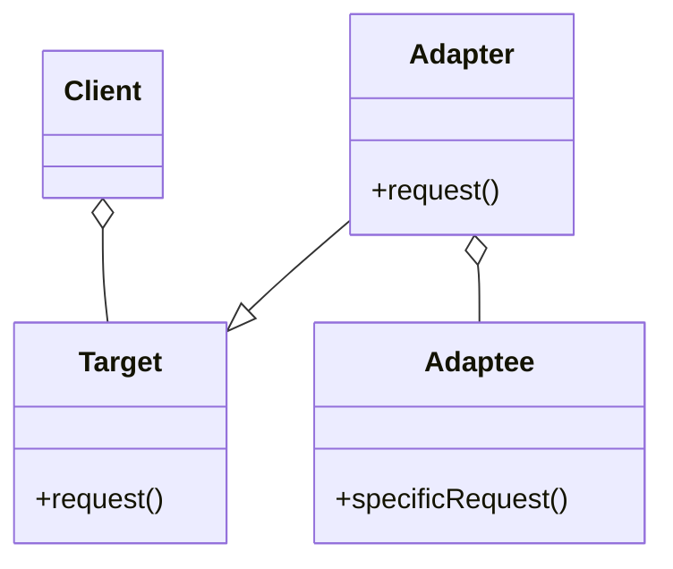

# Section 3 — The Adapter Pattern

> _Documented after our discussion of lectures 3.1 (Understanding the Adapter
> pattern) and 3.2 (The Adapter pattern defined)._

---

## 1. Lecture 3.1 — Understanding the Adapter pattern

### Takeaways (from the video)

- The Adapter pattern helps make two incompatible interfaces work together by
  creating an adapter class that translates between them.
- It allows you to swap out components (like vendor classes) with different
  interfaces without changing the existing system code.
- This pattern keeps the system flexible and resilient to change by isolating
  the interface differences within the adapter.

### Why it matters (our discussion)

All three takeaways orbit one central problem: **two interfaces that don't
match, and client code that's already written to one of them.**

**The two bad choices vs. the Adapter:**

| Approach | What changes | Risk |
|---|---|---|
| Change the client to understand Turkeys | Many files, `if (is a turkey)` branches everywhere | Fragile, hard to maintain |
| **Adapter (the chosen one)** | **One** small translator class | Confined, safe |

**Why the Adapter is the "safe" choice:** it keeps the change in ONE small
place.

- The client (`testDuck`) — **zero changes.** It keeps calling `quack()`/`fly()`.
- The concrete classes (`MallardDuck`, `WildTurkey`) — **zero changes.** Neither
  knows about the other.
- The adapter (`TurkeyAdapter`) — the **only** new thing. It holds **all** of
  the translation logic.

So when a third-party vendor ships a new class with a weird interface, you
don't touch your system. You write **one** adapter. If they change their
interface later, only the adapter changes.

**The structural reason it works (no magic):**

- The adapter **implements the target interface** (`TurkeyAdapter implements
  Duck`) — so the client sees a valid `Duck`.
- The adapter **composes the adaptee** (it holds a `Turkey turkey` field) — so
  the real work is done by the original object.
- The adapter **translates every method call** (`quack()` → `turkey.gobble()`).

> **One sentence:** "implements the target, wraps the adaptee, translates the
> calls." That is the whole pattern.

---

---

## 2. Lecture 3.2 — The Adapter pattern defined

### The GoF definition

> *"This pattern converts **the interface of a class** into **another interface**
> that **clients expect**. It allows classes to work together that couldn't
> otherwise because of incompatible interfaces."*

Three parts to unpack:

1. **"converts the interface of a class"** — there's an existing class with
   its own interface (the **Adaptee**).
2. **"into another interface"** — we want a *different* interface.
3. **"that clients expect"** — the **Target**: the interface the client is
   already coded to.

The second sentence gives the *why*: the two classes couldn't work together
before because their interfaces didn't match. The Adapter makes them work
together now, without changing either.

### The 4 roles (official vocabulary)

| Role | What it is | Duck/Turkey example |
|---|---|---|
| **Target** | The interface the client expects | `Duck` |
| **Client** | Code that uses the Target; unaware of the Adaptee | `testDuck` |
| **Adaptee** | The existing class with the "wrong" interface | `Turkey` |
| **Adapter** | Converts Adaptee → Target; translates every call | `TurkeyAdapter` |

### The structure (class diagram)

The three connections tell the whole story:

1. **Client → Target (`uses`)** — the client *only knows* the `Target`
   interface.
2. **Adapter → Target (`implements`)** — the Adapter *is-a* Target (usable
   anywhere a Target is expected).
3. **Adapter → Adaptee (`adapts`)** — the Adapter *has-a* Adaptee (wraps it,
   calls its methods).

### The concrete analogy (phone-charging edition)

- Duck = USB-C. Turkey = Lightning. Client = the charging cable (only knows
  USB-C).
- **Target** = the Dock interface (what the cable expects).
- **Client** = the cable; can only plug into something that *is* a Dock.
- **Adaptee** = the Turkey — the thing we have, but Lightning, not USB-C.
- **Adapter** = TurkeyAdapter — a dongle: one side USB-C (fits the cable),
  the other side Lightning (fits the Turkey).

The client is **unaware** it's talking to a Turkey. The Turkey is **unaware**
it's being used as a Dock. The dongle translates every signal between them.

### The key realization

> **The Adapter has a foot in BOTH interfaces — but in different ways:**
> - It **implements** the Target (so the client accepts it).
> - It **holds** the Adaptee (so it can reach the real object).

That "implements the Target + composes the Adaptee" is the whole trick — a
bridge object standing between two incompatible vocabularies, translating each
call.

### Direction of translation

Every call flows **client → Target → Adapter → Adaptee**:

- Client calls `duck.quack()` (Target vocabulary).
- It lands on `TurkeyAdapter.quack()`.
- The Adapter translates it into `turkey.gobble()` (Adaptee vocabulary).
- The Adaptee actually does the work.

### Translation isn't always 1:1

Sometimes `Target.method()` maps directly to `Adaptee.otherMethod()` (a rename:
`quack()` → `gobble()`). But sometimes the Adapter adds logic to make the
semantics match — e.g. `fly()` calls `turkey.fly()` **five times**, because a
turkey only flies a short distance but a duck flies far. Both are
"translation"; the second is *logic-aware* translation, which is what makes it
a real pattern rather than just a rename helper.

### Why we bother (the payoff)

The moment the Adapter is introduced, the client and every existing Target
work with the Adaptee — **with zero changes to the client code**. The client
depends only on the stable Target forever. New adaptees (Drones, vendor
classes, third-party code) slot in behind new adapters; the client never
notices.

---

_Status: Lectures 3.1 & 3.2 documented. Next: **lecture 3.3 (Using the Adapter
pattern — the Java code)**, then the TypeScript translation._
