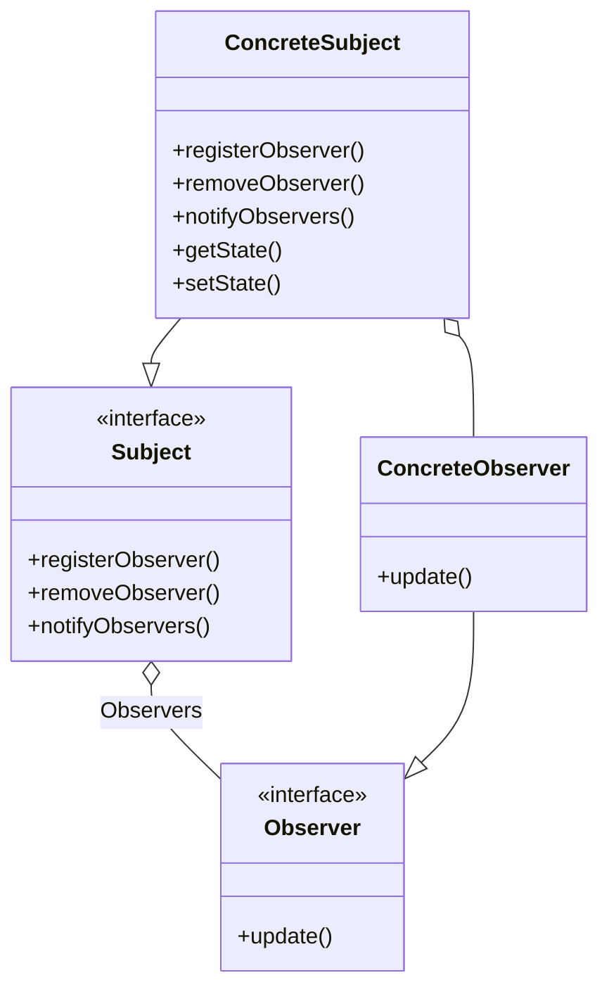

# Section 4 — The Observer Pattern

> _Documented after our discussion of lectures 4.1 (Understanding the Observer
> pattern), 4.2 (The Observer pattern defined), and 4.4 (loose coupling),
> plus the TypeScript implementation._

---

## 1. Lecture 4.1 — Understanding the Observer pattern

### Takeaways (from the video)

- The Observer pattern embodies the design principle of **loose coupling** —
  objects interact without being overly dependent on each other, which keeps
  designs flexible.
- It works like a **subscription system** where a publisher notifies all
  subscribed objects (observers) about changes in data or events.
- It is widely used in software to manage complex scenarios with many objects
  needing updates, helping maintain clean and adaptable code.

### The core idea — a one-to-many relationship

The pattern is a **one-to-many** relationship where the "one" automatically
tells the "many" when something changes:

| Magazine world | Pattern term |
|---|---|
| The publisher / magazine office | **Subject** (a.k.a. Observable / Publisher) |
| A reader | **Observer** (a.k.a. Subscriber / Listener) |
| Subscribing | `registerObserver()` / `subscribe()` |
| Unsubscribing | `removeObserver()` / `unsubscribe()` |
| A new issue is published | `notifyObservers()` |
| Receiving the issue | `update()` on each observer |

### What the observable holds

The observable holds a **list of observers**, and that list is typed as the
**Observer interface** — not as any specific concrete class:

```ts
// inside the Subject:
private observers: Observer[] = [];   // ← a LIST, typed by the INTERFACE
```

### What each side does

**The observable (the "one"):**
- holds a list of `Observer`s
- `registerObserver()` — adds an observer to the list
- `removeObserver()` — removes an observer from the list
- `notifyObservers()` — loops over the list and calls `update()` on each

**The observer (one of the "many"):**
- implements the `Observer` interface
- has an `update()` method
- does its **own business** inside `update()` — the observable never knows or
  cares what that business is

### Why this is loose coupling (the payoff)

The observable depends on **one** thing — the `Observer` interface. It does
**not** depend on `Display`, `Logger`, `PhoneApp`, or any concrete class.

- Add a new observer type → just implement `Observer` and call
  `registerObserver()`. The observable never changes.
- Remove an observer → just call `removeObserver()`. The observable never
  changes.
- The arrows of knowledge collapse from **N** (one per dependent) to **1**
  (one to the Observer interface).

```
Without Observer:                  With Observer:

  Subject ──knows──▶ Display1       Subject ──holds a list──▶ [ Observer (interface) ]
          ──knows──▶ Display2                                     ▲ ▲ ▲ ▲ ▲
          ──knows──▶ Alarm                              Display1, Display2, Alarm, Logger, App
          ──knows──▶ Logger         (add a 6th → just subscribe it;
          ──knows──▶ PhoneApp        Subject never changes)
  (add a 6th → modify Subject's code)
```

### Why the pattern is everywhere

A huge number of real systems are fundamentally "one thing changed → many
things need to react":

- GUI button click → multiple handlers react (`addEventListener`)
- A stock price changes → charts, alerts, portfolios all update
- A sensor reading changes → dashboard, logger, alarm all fire
- A chat message arrives → every participant's screen updates
- Browser events: `addEventListener('click', ...)` is literally subscribing an
  observer to a click "subject"
- React state → re-render is conceptually the same idea
- MQTT / Pub-Sub / message queues in distributed systems are the Observer
  pattern scaled up to networks

### The mental model in one sentence

> **The observable holds a list of `Observer`s (typed by the interface, not by
> concrete class). It exposes `registerObserver()` / `removeObserver()` to
> manage the list and `notifyObservers()` to call `update()` on every entry.
> Each observer implements the `Observer` interface and does its own business
> inside `update()` — the observable never knows or cares what that business
> is.**

---

## 2. Lecture 4.2 — The Observer pattern defined

### The GoF definition

> *"This pattern defines a **one-to-many dependency** between objects so that
> when one object changes state, all of its dependents are **notified and
> updated automatically**."*

| Phrase | Meaning |
|---|---|
| **one-to-many dependency** | One subject, many observers depend on it |
| **changes state** | The subject's data changes (e.g. a temperature reading) |
| **notified and updated automatically** | Observers don't poll — they're *pushed* updates |
| **dependents** | The observers — they depend on the subject for their data |

The key word is **"automatically."** Observers don't ask ("is it ready yet?");
they subscribe once, and updates arrive on their own. That's the difference
between **push** (Observer) and **pull** (no pattern).

### Takeaways (from the video)

- The Observer pattern defines a one-to-many relationship where one **subject**
  (publisher) owns the data, and many **observers** (subscribers) depend on it
  and get notified automatically when the subject's state changes.
- It promotes a clean design by having a **single source of truth** (the
  subject) and notifying all dependent objects without them owning the data
  themselves.
- The typical class design includes a **subject interface** for managing
  observers (register, remove, notify) and an **observer interface** with an
  `update()` method that concrete observers implement to react to changes.

### The "single source of truth" idea

The subject **owns** the data. The observers don't each keep their own copy —
there's one subject that holds it, and the observers just *react* to it.

**Why this matters:** if five displays each stored their own copy of the data,
they could drift out of sync. With a single source of truth, that can't happen
— the subject is the authority, and every observer sees the same state when
notified.

### The class diagram



### The four boxes

**The two interfaces (the contracts):**

| Interface | Methods | Role |
|---|---|---|
| `Subject` | `registerObserver()`, `removeObserver()`, `notifyObservers()` | What any observable must do |
| `Observer` | `update()` | What any observer must do — react when notified |

**The two concretes (the real classes):**

| Class | Implements | Adds |
|---|---|---|
| `ConcreteSubject` | `Subject` | **state** (`getState()`/`setState()`) — owns the data; when `setState()` changes it, calls `notifyObservers()` |
| `ConcreteObserver` | `Observer` | implements `update()` to react; holds a reference to the subject to pull data if needed |

### The four arrows

1. `Subject o-- Observer` — the Subject interface **holds** a list of
   Observers. *This is the loose-coupling arrow: Subject only knows the
   Observer interface, never a concrete class.*
2. `ConcreteSubject --|> Subject` — ConcreteSubject **implements** Subject.
3. `ConcreteObserver --|> Observer` — ConcreteObserver **implements** Observer.
4. `ConcreteSubject o-- ConcreteObserver` — at runtime, ConcreteSubject holds
   ConcreteObserver instances in its list (the concrete version of arrow #1).

**Arrow #1 is the most important.** It means the subject is coupled to the
**interface**, not to any concrete observer. That's why you can add a 6th, 7th,
8th observer without touching the subject.

### The flow of a single update

When the subject's state changes:

1. **`ConcreteSubject.setState()`** is called — the data changes.
2. Inside `setState()`, the subject calls **`notifyObservers()`**.
3. `notifyObservers()` loops over its `Observer[]` list and calls **`update()`**
   on each.
4. Each **`ConcreteObserver.update()`** runs — it does its own business
   (display, log, alarm).
5. Optionally, the observer calls **`getState()`** on the subject to pull the
   new data.

```
setState() → notifyObservers() → [for each observer] → update() → (optionally) getState()
```

The subject never calls any method except `update()` on the observers. It
doesn't know what they do with the notification. That's loose coupling made
concrete.

### Pull vs Push (a subtlety the diagram hints at)

The diagram shows `getState()` on ConcreteSubject because there are **two ways**
the subject can deliver data:

| Style | How it works | Signature |
|---|---|---|
| **Push** | The subject passes data *into* `update()` | `update(temp, humidity, pressure)` |
| **Pull** | The subject says "I changed" via `update()`, the observer calls `getState()` | `update()` + `subject.getState()` |

The diagram shows the **pull** model (`getState()` present, `update()` has no
parameters). The course example uses the push model. The pull model is more
flexible — observers pull only the fields they care about.

### The full mental model

> **Two interfaces define the pattern: `Subject` (register/remove/notify) and
> `Observer` (update). `ConcreteSubject` owns the data (single source of truth)
> and, whenever its state changes, calls `notifyObservers()` which loops over
> its `Observer[]` list and calls `update()` on each. `ConcreteObserver`
> implements `update()` to do its own business. Because the subject only knows
> the `Observer` interface — never any concrete class — the system is loosely
> coupled: new observers can be added or removed without ever touching the
> subject.**

---

## 3. Lecture 4.4 — The Observer pattern and loose coupling

### Takeaways (from the video)

- The Observer pattern enables **loose coupling** by having subjects and
  observers interact through an interface, without knowing each other's
  concrete classes.
- The subject maintains a list of observers and notifies them of changes, but
  **doesn't care about their specific implementations**.
- Observers can **dynamically subscribe, unsubscribe, or be replaced** without
  affecting the subject, making the design flexible and easy to extend.

### The three design choices that create loose coupling

| Design choice | What it means | Which takeaway |
|---|---|---|
| **Subject depends on the Observer interface** | Not on any concrete class | #1 |
| **Subject only calls `update()`** | Doesn't know what observers do inside | #2 |
| **Observers managed via a list + register/remove** | Can change at runtime | #3 |

All three together = maximum flexibility. Remove any one and coupling gets
tighter.

### Tight coupling vs. loose coupling (in code)

```ts
// TIGHTLY COUPLED — every new observer means editing the subject:
this.display.update(temp);
this.statistics.update(temp);
this.forecast.update(temp);
// add a 4th → edit this method

// LOOSELY COUPLED — never changes, no matter how many observers:
for (const observer of this.observers) {
  observer.update(temp, humidity, pressure);
}
```

### Dynamic subscribe/unsubscribe (at runtime)

| Action | Method called | Subject's code changes? |
|---|---|---|
| Add a new observer at runtime | `registerObserver(newObserver)` | ❌ No |
| Remove an observer at runtime | `removeObserver(oldObserver)` | ❌ No |
| Replace one observer with another | `removeObserver(old)` + `registerObserver(new)` | ❌ No |

This is **open-closed** behavior: the subject is *open for extension* (new
observers slot in) but *closed for modification* (its source code doesn't
change).

## 4. The TypeScript implementation

The pattern is implemented in `sandbox/04-observer/`. All files compile cleanly
and the weather station runs end-to-end — including a demo of dynamic
subscribe/unsubscribe at runtime.

### File structure

```
sandbox/04-observer/
├── interfaces.ts        ← Subject, Observer, DisplayElement (the contracts)
├── weather-data.ts      ← WeatherData (ConcreteSubject — owns the data)
├── displays.ts          ← 4 ConcreteObservers (Current, Statistics, Forecast, HeatIndex)
└── weather-station.ts   ← the client (creates subject + observers, feeds data)
```

Run it:
```bash
npm run start -- 04-observer/weather-station.ts
```

### `interfaces.ts` — the contracts

```ts
/** SUBJECT — the "publisher" contract. */
export interface Subject {
  registerObserver(o: Observer): void;
  removeObserver(o: Observer): void;
  notifyObservers(): void;
}

/** OBSERVER — the "subscriber" contract (PUSH model). */
export interface Observer {
  update(temp: number, humidity: number, pressure: number): void;
}

/** DISPLAY ELEMENT — a separate responsibility ("display yourself"). */
export interface DisplayElement {
  display(): void;
}
```

The course uses the **push model** — `update()` receives the data directly.
`DisplayElement` is a separate interface so the display concern is decoupled
from the observer concern.

### `weather-data.ts` — the ConcreteSubject

```ts
export class WeatherData implements Subject {
  private observers: Observer[] = [];    // ← list typed by the INTERFACE
  private temperature = 0;
  private humidity = 0;
  private pressure = 0;

  registerObserver(o: Observer): void { this.observers.push(o); }
  removeObserver(o: Observer): void {
    const i = this.observers.indexOf(o);
    if (i >= 0) this.observers.splice(i, 1);
  }
  notifyObservers(): void {
    for (const observer of this.observers) {
      observer.update(this.temperature, this.humidity, this.pressure);
    }
  }
  setMeasurements(t: number, h: number, p: number): void {
    this.temperature = t; this.humidity = h; this.pressure = p;
    this.notifyObservers();
  }
}
```

`notifyObservers()` is the loose-coupling payoff: one loop, one method call
(`update()`), no knowledge of what any observer does.

### `displays.ts` — the ConcreteObservers

Each display implements **both** `Observer` and `DisplayElement`, and
**self-registers** in its constructor:

```ts
export class CurrentConditionsDisplay implements Observer, DisplayElement {
  private temperature = 0;
  private humidity = 0;

  constructor(weatherData: Subject) {
    weatherData.registerObserver(this);  // ← self-subscribes
  }

  update(temp: number, humidity: number, _pressure: number): void {
    this.temperature = temp;
    this.humidity = humidity;
    this.display();                       // ← does its own business
  }

  display(): void {
    console.log(`Current conditions: ${this.temperature}F degrees and ${this.humidity}% humidity`);
  }
}
```

Four displays, each doing different things in `update()`:
- **CurrentConditionsDisplay** — shows current temp + humidity
- **StatisticsDisplay** — tracks avg/max/min over time
- **ForecastDisplay** — predicts weather from pressure changes
- **HeatIndexDisplay** — computes a derived value (heat index formula)

The subject never knows what any of them do. That's loose coupling.

### `weather-station.ts` — the client

```ts
const weatherData = new WeatherData();

// Each display self-registers in its constructor:
new CurrentConditionsDisplay(weatherData);
new StatisticsDisplay(weatherData);
new ForecastDisplay(weatherData);
new HeatIndexDisplay(weatherData);

// Each call pushes to all 4 displays:
weatherData.setMeasurements(80, 65, 30.4);
weatherData.setMeasurements(82, 70, 29.2);
weatherData.setMeasurements(78, 90, 29.2);
```

### Sample output

```
--- Measurement 1: 80°F, 65%, 30.4 ---
Current conditions: 80F degrees and 65% humidity
Avg/Max/Min temperature = 80/80/80
Forecast: Improving weather on the way!
Heat index is 82.95535063709998

--- Removing ForecastDisplay, then new measurement ---
Current conditions: 75F degrees and 80% humidity
Avg/Max/Min temperature = 78.75/82/75
Heat index is 78.4801912799999
                                        ← no Forecast line! it was removed

--- Re-adding ForecastDisplay, then new measurement ---
Current conditions: 70F degrees and 75% humidity
Avg/Max/Min temperature = 77/82/70
Heat index is 75.8199275515626
Forecast: Improving weather on the way!  ← Forecast is back!
```

The dynamic unsubscribe/subscribe demo proves the loose-coupling claim:
removing and re-adding `ForecastDisplay` required **zero changes** to
`WeatherData`.

### TypeScript practices used

| Practice | Where | Why |
|---|---|---|
| `interface` for multi-method contracts | `interfaces.ts` | Subject has 3 methods, Observer has 1 with 3 params |
| `import type` for interfaces | all files | `verbatimModuleSyntax` requires type-only imports |
| `private observers: Observer[]` | `weather-data.ts` | List typed by the interface — the loose-coupling arrow |
| Self-registration in constructor | `displays.ts` | Each observer subscribes itself: `weatherData.registerObserver(this)` |
| `_pressure` / `_humidity` prefix | `displays.ts` | Marks intentionally-unused params (avoids `noUnusedParameters` errors) |
| `implements Observer, DisplayElement` | `displays.ts` | A class can implement multiple interfaces |
| `process.stdout.write()` | `ForecastDisplay` | Prints without a newline (Java's `System.out.print` equivalent) |

---

_Status: Lectures 4.1, 4.2 & 4.4 documented + TypeScript implementation in the
sandbox. Next: lecture 4.3 (Using the Observer pattern), then the challenge
and solution videos._
