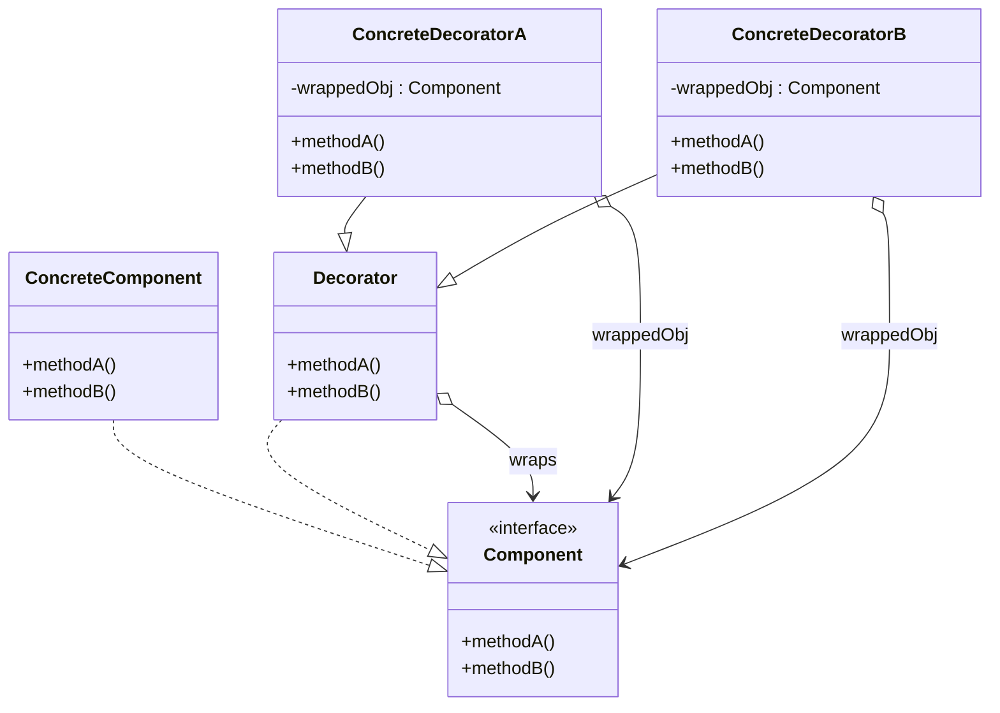

# Section 5 — The Decorator Pattern

> _Documented after our discussion of lectures 5.1 (Creating chaos with
> inheritance), 5.2 (Understanding the open-closed principle), and 5.4
> (Understanding the Decorator pattern)._

---

## 1. Lecture 5.1 — Creating chaos with inheritance

### Takeaways (from the video)

- Using inheritance to handle many beverage and condiment combinations leads to
  complex, hard-to-maintain code with many subclasses.
- The decorator pattern offers a flexible alternative by using composition to
  add condiments dynamically, avoiding the explosion of subclasses.
- This pattern supports easier extension and maintenance, allowing new drinks
  or condiments to be added without changing existing code.
- This approach aligns with the design principle of favoring composition over
  inheritance, helping create more adaptable and resilient software.

### The problem — "class explosion" via inheritance

The course uses the **Starbuzz Coffee** example. You sell beverages
(HouseBlend, DarkRoast, Decaf, Espresso) and customers can add condiments
(Milk, Mocha, Soy, Whip).

**The inheritance approach** — make a subclass for every combination:

```
Beverage
├── HouseBlend
├── HouseBlendWithMilk
├── HouseBlendWithMocha
├── HouseBlendWithMilkAndMocha
├── HouseBlendWithMilkAndWhip
├── HouseBlendWithMochaAndWhip
├── HouseBlendWithMilkAndMochaAndWhip
├── DarkRoast
├── DarkRoastWithMilk
├── ... (and so on for Decaf, Espresso)
```

**Count the explosion:**
- 4 beverages × combinations of 4 condiments = up to 4 × 2⁴ = **64 classes**
- Add a 5th condiment → 4 × 2⁵ = **128 classes**
- Add a 6th condiment → **256 classes**

This is **exponential growth** — the classic "class explosion." Every new
condiment doubles the number of classes.

**Why this is unmaintainable:**
- Adding a new condiment means creating dozens of new subclasses.
- If the price of milk changes, you must find and update every class that
  mentions milk.
- You can't handle "double mocha" without yet another class.
- Class names become absurd: `HouseBlendWithMilkAndMochaAndWhipAndSoy`.

### Why inheritance is the wrong tool here

Inheritance is for **IS-A** relationships ("a MallardDuck IS-A Duck"). But
"HouseBlend with milk" is **not a new kind of beverage** — it's a HouseBlend
**plus** a condiment. The condiments are **additions**, not specializations.

**The deeper insight:** inheritance is the right tool when the relationship is
*"X is a type of Y."* It's the wrong tool when the relationship is *"X is Y
with some stuff added to it."* The first is a taxonomy; the second is a
configuration. The Decorator pattern exists precisely to handle the
configuration case with composition.

| | Duck hierarchy (IS-A works) | Beverage + condiments (IS-A fails) |
|---|---|---|
| Relationship | "MallardDuck IS-A Duck" | "HouseBlend+Milk is NOT a new kind of beverage" |
| What subclasses represent | Real, distinct kinds of things | Combinations, not types |
| Adding a variant | One new class | Dozens of new classes (exponential) |

### The solution — composition (the Decorator idea)

Instead of inheriting to add condiments, you **wrap** a beverage with condiment
objects (decorators):

| | Inheritance (chaos) | Composition (Decorator) |
|---|---|---|
| Add milk | Create `HouseBlendWithMilk` subclass | Wrap: `new Milk(new HouseBlend())` |
| Add mocha too | Create `HouseBlendWithMilkAndMocha` | Wrap again: `new Mocha(new Milk(new HouseBlend()))` |
| New condiment | N new subclasses | One new decorator class |
| "Double mocha" | Need a special class | `new Mocha(new Mocha(...))` — just wrap twice |

The number of classes is now **linear, not exponential**:
- 4 beverage classes + 4 condiment classes = **8 classes total**
- Add a 5th condiment → **9 classes** (one new decorator), not 128.

### "Dynamic" composition

The wrapping happens **at runtime** — you build the exact drink the customer
orders by nesting decorators around the base beverage:

```ts
// "DarkRoast with double mocha and whip":
new Whip(new Mocha(new Mocha(new DarkRoast())))
```

The nesting reads **inside-out**: start with `DarkRoast` (the base), wrap in
`Mocha` (shot 1), wrap in another `Mocha` (shot 2), wrap in `Whip`. Each
decorator is the **same type** as what it wraps (so they can nest), and each
**adds** one ingredient's cost + description. No subclassing, no recompiling.

### The open-closed principle (preview)

> *Classes should be **open for extension** (you can add new behavior) but
> **closed for modification** (you don't touch existing source code).*

With the Decorator:
- Add a new beverage (e.g. `Decaf`) → one new class. Existing classes untouched.
- Add a new condiment (e.g. `Caramel`) → one new decorator. Existing classes
  untouched.
- Change milk's price → edit one file (`Milk`). No hunting through 64 classes.

### Design principle #3 — favor composition over inheritance

> **Favor composition (HAS-A) over inheritance (IS-A).**

- **Inheritance** is static (compile time), rigid (a subclass is forever that
  subclass), and forces deep hierarchies.
- **Composition** is dynamic (runtime), flexible (mix and match), and flat
  (no hierarchy explosion).

The Decorator embodies this: a decorated beverage **HAS-A** beverage inside
it (it wraps one), rather than **IS-A** specific subclass. That HAS-A
relationship is what lets you stack condiments freely.

**Connection to Strategy:** the `Duck` class already used this principle — it
**HAS-A** `FlyBehavior` (composition) instead of inheriting flying behavior. The
Decorator takes the same idea further: it wraps an object with **another object
of the same type**, layering behavior.

### The mental model so far

> **Instead of subclassing for every combination (which explodes
> exponentially), wrap a base object with decorator objects that each add one
> ingredient. Decorators have the same type as the thing they wrap, so they
> can nest. Adding a new condiment = one new class, not dozens. This is
> "favor composition over inheritance" made structural.**

---

## 2. Lecture 5.2 — Understanding the open-closed principle

### Takeaways (from the video)

- The open-closed principle means software should be **open for extension but
  closed for modification**, allowing new features without changing existing
  code.
- Inheritance can lead to fragile designs that are hard to change, while
  **composition** offers more flexibility by assembling behaviors at runtime.
- The decorator pattern uses composition to add new behavior dynamically,
  making designs more adaptable and easier to maintain without modifying
  existing classes.

### The principle — exactly what it means

**"Open for extension"** = you can add new behavior/features **without breaking**
what already works.

**"Closed for modification"** = you don't have to **edit** existing, working,
tested code to add that new feature.

> **The goal: add new stuff by writing NEW code, not by changing OLD code.**

**Why "closed for modification" matters:** existing code is usually already
tested, deployed, and used by many things. Editing it risks breaking all of
those. So structure the design so a new feature = a new file, not an edit to
an existing one.

### The crucial nuance — don't over-apply it

**"Closed for modification" does NOT mean "never edit ANY existing file."**
Two distinctly different kinds of changes:

| Kind of change | Do you edit existing files? | Is this "extension"? |
|---|---|---|
| **Add a new feature/behavior** (new condiment, new beverage) | ❌ No — write a new file | ✅ Yes — what open-closed protects |
| **Change existing behavior** (milk's price rises, fix a bug) | ✅ Yes — edit the relevant file | ❌ No — a legitimate change |

If you take "closed for modification" too literally as "never touch anything,"
you'll end up with unmaintainable designs (some changes genuinely require
editing existing files). The principle is a **design target for extensibility**,
not an absolute ban on editing.

### Why inheritance → fragile; composition → flexible

**Inheritance leads to fragile, hard-to-change designs:**
1. Tight coupling to the parent — change the parent, every child is affected.
2. The **fragile base class** problem — a small change to a widely-inherited
   base can silently break many subclasses.
3. **Static** — decided at compile time; can't mix differently at runtime.
4. The class explosion we saw in 5.1.

**Composition is more flexible:**
1. **Assembled at runtime** — build behavior by composing objects.
2. **Loose coupling** — objects interact through interfaces, not deep
   parent-child chains.
3. **Swap/stack freely** — add, remove, or reorder behaviors dynamically.
4. **Flat, not deep** — no explosion of combination subclasses.

The key phrase is **"assembling behaviors at runtime"** — composition lets you
*configure* an object's behavior when the program runs, which inheritance
(compile-time) cannot do.

### The Decorator as the concrete implementation

The Decorator ties it all together — it is a concrete realization of BOTH the
open-closed principle AND "favor composition."

- **Open for extension:** add a new condiment → write one new decorator class. ✅
- **Closed for modification:** the beverage classes and existing decorators
  never change. ✅
- **Composition:** each decorator wraps (HAS-A) the object it decorates. ✅
- **Dynamic:** you assemble the drink at runtime by nesting. ✅

### The key maneuver that makes it work

> **The decorator has the SAME TYPE as the object it wraps. So a decorator can
> wrap a base beverage OR another decorator.**

```ts
// Each of these is a valid Beverage (they're all the same type):
Beverage a = new HouseBlend();                          // base
Beverage b = new Mocha(a);                              // decorator wraps base
Beverage c = new Whip(b);                               // decorator wraps decorator
```

Because `Mocha`, `Whip`, and `HouseBlend` are all `Beverage`s, they nest
freely. Each decorator adds its behavior **on top of** whatever it wraps, and
everything still looks like one `Beverage` to the caller. The `Beverage` and
`HouseBlend` code never needs to know about `Mocha` or `Whip` — they're added
purely by composition on the outside.

### How the three takeaways chain together

| Takeaway | What it establishes |
|---|---|
| #1 Open-closed | The **principle**: extend without modifying |
| #2 Composition > inheritance | The **mechanism**: why composition enables #1 |
| #3 Decorator | The **pattern**: a concrete realization of #1 using #2 |

> **The full idea:** the open-closed principle is the *goal* (extend without
> rewriting); "favor composition" is the *strategy* (assemble at runtime rather
> than subclassing); and the Decorator is one concrete *implementation* (wrap an
> object with same-typed decorators that layer behavior).

---

## 3. Lecture 5.4 — Understanding the Decorator pattern

### The GoF definition

> *"This pattern **attaches additional responsibilities** to an object
> **dynamically**. Decorators provide a **flexible alternative to subclassing**
> for extending functionality."*

| Phrase | Meaning |
|---|---|
| **attaches additional responsibilities** | Adds behavior (cost, description) on top of an object |
| **to an object** | To one specific *object*, not a whole class |
| **dynamically** | At runtime, by wrapping — not at compile time by subclassing |
| **flexible alternative to subclassing** | Same goal as inheritance (extend) but without the class explosion |

### The class diagram



### The four kinds of boxes

| Box | Role | Coffee example |
|---|---|---|
| **Component** (interface) | The contract — what everything implements | `Beverage` (interface/abstract) |
| **ConcreteComponent** | A plain base that implements Component | `HouseBlend`, `DarkRoast`, etc. |
| **Decorator** (base) | The abstract "wrapper" type; same as Component | `CondimentDecorator` |
| **ConcreteDecoratorA/B** | Real wrappers that add behavior | `Mocha`, `Whip`, `Milk`, `Soy` |

### The five arrows

1. `ConcreteComponent ..|> Component` — a base beverage **implements** the
   contract.
2. `Decorator ..|> Component` — the decorator base is ALSO a Component. *This
   is the crucial "same type" relationship — it lets decorators nest and be
   used interchangeably with the base.*
3. `ConcreteDecoratorA ..|> Decorator` & `B ..|> Decorator` — the real
   decorators **extend** the decorator base.
4. `Decorator o--> Component : wraps` — the decorator base **holds** a
   Component (composition). The HAS-A that makes it a wrapper.
5. `ConcreteDecoratorA/B o--> Component : wrappedObj` — each concrete decorator
   holds the actual `wrappedObj`.

**The two relationships that matter most:**
- `Decorator ..|> Component` — **IS-A** (same type → interchangeable & nestable)
- `Decorator o--> Component` — **HAS-A** (wraps → can add behavior)

A decorator is **simultaneously** a Component (IS-A) and a holder of a
Component (HAS-A). That dual nature is the entire pattern.

### Mapping the generic diagram to coffee

```
Component   (abstract)     →  Beverage
├─ getDescription()        →  abstract getDescription()
└─ cost()                  →  abstract cost()

ConcreteComponent          →  HouseBlend, DarkRoast, Decaf, Espresso
  (implements Beverage)       (each has its own base cost + description)

Decorator (abstract)       →  CondimentDecorator
  (extends Beverage)          (extends Beverage)
  └─ holds a Beverage         └─ holds a Beverage (wrappedObj)
      ("wraps")

ConcreteDecoratorA/B        →  Mocha, Whip, Milk, Soy
  (extends Decorator)          (extends CondimentDecorator)
  └─ wrappedObj: Beverage      └─ this.beverage
```

### The mechanism — how a call travels through wrappers

**Generic trace:** call `methodA()` on the outermost `ConcreteDecoratorA`:

```
ConcreteDecoratorA.methodA()
  → add my own behavior
  → call wrappedObj.methodA()   [the inner object]
       if inner is a decorator → it does the same
       if inner is ConcreteComponent → base method (stops)
  → (on the way back, possibly combine results)
```

**Coffee trace:** `new Whip(new Mocha(new HouseBlend())).cost()`:

```
Whip.cost()  = 0.10 + Mocha.cost()
                    = 0.20 + HouseBlend.cost()
                                  = 0.89   ← base stops
                    = 1.09
             = 1.19
```

**Description (each decorator prepends its name):**

```
Whip.getDescription()
  = "Whip, " + Mocha.getDescription()
               = "Mocha, " + HouseBlend.getDescription()
                            = "HouseBlend"
               = "Mocha, HouseBlend"
  = "Whip, Mocha, HouseBlend"
```

The calls **cascade down** through the wrappers to the base, then **unwind back
up**, rolling up contributions. That's "attaching responsibilities dynamically."

### Why the pattern works (the deep "why")

1. **Because of IS-A (same type):** a fully decorated beverage is treated as a
   plain `Beverage`. The client doesn't know or care how many layers it has.
2. **Because of HAS-A (wrapping):** stack any combination, any order, at
   runtime — `new Mocha(new Mocha(new Mocha(new Espresso())))`. No new class.
3. **Because of delegation + augmentation:** each decorator adds its piece,
   then hands off the rest to the wrapped object.
4. **Because it's closed for modification:** adding `Caramel` = one new class;
   everything existing is untouched (open-closed).

### A subtle but important caveat

A **ConcreteComponent** (HouseBlend) creates its own state (price,
description). A **ConcreteDecorator** (Mocha) does NOT — it **delegates** to
the `wrappedObj` it holds, adding only its own increment. The difference shows
up in `cost()`/`getDescription()` overrides: decorators add their contribution
and call `wrappedObj.cost()`/`getDescription()`, rather than returning a fixed
value themselves.

### The full mental model

> **The Decorator pattern wraps a Component in a same-typed Decorator that
> adds behavior and delegates the rest. Because the Decorator IS-A a Component
> and HAS-A a Component, decorated objects are interchangeable with the base
> and can be nested arbitrarily. A call on the outermost wrapper cascades down
> to the base and unwinds back up, stacking each decorator's contribution.
> Adding new behavior = one new decorator class; nothing existing is modified —
> open-closed achieved via composition.**

---

_Status: Lectures 5.1, 5.2 & 5.4 documented. Next: **lecture 5.5 (Using the
Decorator pattern — the Java StarbuzzCoffee code)**, then the TypeScript
translation._
