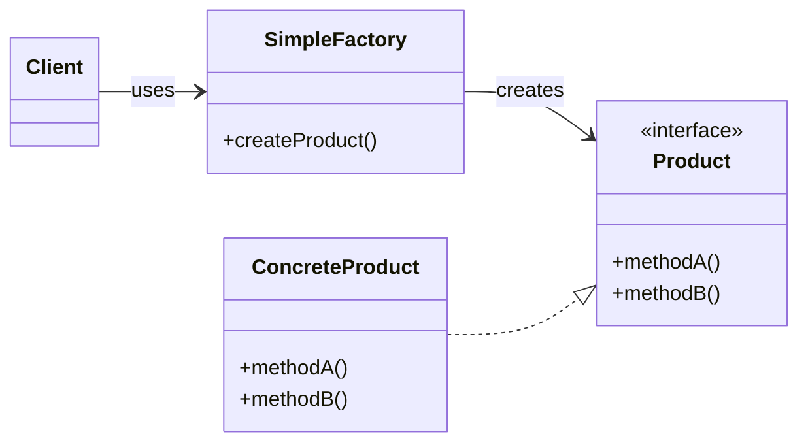

# Section 7 — The Factory Patterns

> _Documented after our discussion of lecture 7.1 (The Simple Factory pattern)
> and 7.2 (The Factory Method pattern)._

---

## 1. Lecture 7.1 — The Simple Factory pattern

### Takeaways (from the video)

- The simple factory pattern helps manage object creation by **encapsulating
  it in a separate factory class**, rather than creating objects directly in
  client code.
- This approach follows the **open-closed principle** by allowing new types
  to be added without modifying existing client code.
- The factory method takes a **type parameter** and returns an object that
  implements a **common interface**, making the client code more flexible and
  easier to maintain.

### The root problem — `new` is hardcoded everywhere

When you write `new CheesePizza()` directly in your code, you're doing two
things at once:
1. **Creating** an object.
2. **Committing to a specific concrete class** (`CheesePizza`).

That second thing is the problem. Every `new CheesePizza()` ties your code to
that exact class.

**Without a factory — the pizza store does two jobs:**
```ts
class PizzaStore {
  orderPizza(type: string): Pizza {
    let pizza: Pizza;
    if (type === "cheese") {
      pizza = new CheesePizza();      // ← hardcoded "new"
    } else if (type === "pepperoni") {
      pizza = new PepperoniPizza();   // ← hardcoded "new"
    } else if (type === "veggie") {
      pizza = new VeggiePizza();      // ← hardcoded "new"
    }
    pizza.prepare();
    pizza.bake();
    pizza.cut();
    pizza.box();
    return pizza;
  }
}
```

**Why this is bad:**
1. **Tightly coupled to concrete classes** — the store knows about every
   concrete pizza (violates "program to an interface").
2. **Adding a new type means editing the store** — adding `BBQChickenPizza`
   means another `else if` (violates open-closed).
3. **Creation is mixed with workflow** — `orderPizza` does both *which pizza*
   and *prepare/bake/cut/box* (violates single responsibility).

### The solution — pull creation into a factory class

```ts
class SimplePizzaFactory {
  createPizza(type: string): Pizza {
    if (type === "cheese")     return new CheesePizza();
    if (type === "pepperoni")  return new PepperoniPizza();
    if (type === "veggie")     return new VeggiePizza();
    return null as unknown as Pizza;
  }
}

class PizzaStore {
  constructor(private factory: SimplePizzaFactory) {}

  orderPizza(type: string): Pizza {
    const pizza = this.factory.createPizza(type);  // ← just ask the factory
    pizza.prepare();
    pizza.bake();
    pizza.cut();
    pizza.box();
    return pizza;
  }
}
```

- The store no longer has any `new CheesePizza()` — it calls
  `factory.createPizza(type)`.
- The `if/else` creation logic moved into the factory.
- The store's `orderPizza` now only does the *workflow*. One job.

This is **"encapsulate what varies"**: the part that varies is *which concrete
pizza to create*, so we encapsulate it in its own class.

### The open-closed view

| Adding… | Without factory | With Simple Factory |
|---|---|---|
| A new pizza type ("bbq") | Edit `PizzaStore.orderPizza` ❌ | Edit `SimplePizzaFactory.createPizza` — **store untouched** ✅ |

**The subtle point:** the open-closed principle applies to the *client* (the
store) — the code that *uses* the creation, not the code that *does* the
creation. Something has to know about concrete classes; the factory's *whole
job* is to know. The benefit is that the **client is shielded** from those
changes. The Simple Factory **localizes** the change to one place.

### The mechanics

1. **Takes a type parameter** — the client says *what kind* it wants ("cheese"),
   not *which class*.
2. **Returns a common interface** — the factory returns `Pizza`, not
   `CheesePizza`.

The client never sees `CheesePizza` — it only sees `Pizza`. This is **"program
to an interface"** applied to *creation*.

### The class diagram



**The key insight from the arrows:** the Client has **NO arrow to
`ConcreteProduct`.** That absence IS the pattern. The factory inserts itself
as a middleman that absorbs the coupling to concrete classes.

### Is it the same as Repository or Registry?

**No to both.** Different problems, different intents:

| | Simple Factory | Repository | Registry |
|---|---|---|---|
| **Purpose** | **Create** new objects | **Retrieve/store** persisted objects | **Look up** already-registered objects |
| **What it returns** | A brand-new instance | An existing persisted object | A previously-registered instance |
| **Key methods** | `createPizza(type)` | `findById(id)`, `save(entity)` | `get(key)`, `register(key, instance)` |
| **Instance exists before you call?** | ❌ No — made on the spot | ✅ Yes — in storage | ✅ Yes — registered earlier |
| **Concern** | Object **construction** | Data **access/persistence** | Object **lookup/location** |

> **Repository = "fetch existing," Registry = "look up registered," Factory =
> "build new."**

### What the Simple Factory is NOT (caveat)

The GoF book lists **Factory Method** and **Abstract Factory** as formal
patterns. The **Simple Factory** is *not* in the GoF book — it's a simpler,
informal idiom. The course introduces it first because it motivates the need
for the formal Factory Method pattern (lecture 7.2).

### The mental model

> **The Simple Factory pulls object creation out of the client and into a
> dedicated factory class. The client says *what type* it wants, and the
> factory returns an object typed as a common interface. The client never
> knows or cares which concrete class was instantiated. This encapsulates the
> creation logic, programs to an interface, and keeps the client closed for
> modification when new types are added.**

---

## 2. Lecture 7.2 — The Factory Method pattern

### Takeaways (from the video)

- The simple factory pattern centralizes object creation but **struggles when
  multiple variations** (like different pizza styles) are needed, leading to
  code duplication.
- The factory method pattern solves this by **defining an abstract class with
  shared methods and deferring the creation of specific objects to
  subclasses**, allowing flexibility for different franchises.
- This pattern helps keep **common processes consistent while enabling
  customization**, improving code maintainability and scalability.

### The limitation of the Simple Factory

The pizza shop is now a **franchise** — New York style AND Chicago style. Same
workflow (prepare, bake, cut, box), but **different concrete pizzas**.

With the Simple Factory, one factory's `if/else` grows to cover every style:
```ts
class SimplePizzaFactory {
  createPizza(type: string): Pizza {
    if (type === "ny-cheese")     return new NYStyleCheesePizza();
    if (type === "ny-pepperoni")  return new NYStylePepperoniPizza();
    if (type === "chi-cheese")    return new ChicagoStyleCheesePizza();
    // add California style? → 3 more branches
    ...
  }
}
```

**Why this struggles:**
1. **One giant method** — every new franchise adds more `if` branches.
2. **No structure for variation** — no formal "NY franchise makes NY pizzas."
3. **Violates open-closed at the factory level** — every new franchise means
   editing the one factory class.

### The Factory Method's key move — two halves

**Half 1 — "an abstract class with shared methods":**

`PizzaStore` becomes an **abstract class** holding the shared workflow:
```ts
abstract class PizzaStore {
  // SHARED workflow — every franchise does this the same way:
  orderPizza(type: string): Pizza {
    const pizza = this.createPizza(type);   // ← calls the factory method
    pizza.prepare();
    pizza.bake();
    pizza.cut();
    pizza.box();
    return pizza;
  }
  // THE FACTORY METHOD — abstract, deferred to subclasses:
  abstract createPizza(type: string): Pizza;
}
```

**Half 2 — "deferring creation to subclasses":**

Each franchise **subclasses** `PizzaStore` and implements `createPizza`:
```ts
class NYPizzaStore extends PizzaStore {
  createPizza(type: string): Pizza {        // ← NY franchise decides
    if (type === "cheese")     return new NYStyleCheesePizza();
    if (type === "pepperoni")  return new NYStylePepperoniPizza();
    return null as unknown as Pizza;
  }
}

class ChicagoPizzaStore extends PizzaStore {
  createPizza(type: string): Pizza {        // ← Chicago franchise decides
    if (type === "cheese")     return new ChicagoStyleCheesePizza();
    if (type === "pepperoni")  return new ChicagoStylePepperoniPizza();
    return null as unknown as Pizza;
  }
}
```

**Usage:**
```ts
const nyStore = new NYPizzaStore();
const chiStore = new ChicagoPizzaStore();
nyStore.orderPizza("cheese");    // → NY-style cheese pizza (same workflow)
chiStore.orderPizza("cheese");   // → Chicago-style cheese pizza (same workflow)
```

`orderPizza("cheese")` runs the **same** shared workflow in both stores, but
each store's `createPizza` produces a **different** concrete pizza. Same
process, different product.

### Why it's called "Factory METHOD"

The pattern centers on one **method** that's abstract in the parent and
concrete in each subclass:

- `orderPizza()` is a **concrete method** — the shared algorithm. It calls
  `createPizza()` and works with whatever comes back.
- `createPizza()` is the **factory method** — abstract, so each subclass
  implements it differently.

The parent **defines** the interface of the factory method but **defers** the
implementation to subclasses — the **"virtual constructor"** idea.

### Common process consistent, customization enabled

| Concern | Where it lives | Who controls it |
|---|---|---|
| The workflow (prepare/bake/cut/box) | Abstract parent `PizzaStore` | Shared — no franchise can change it |
| Which concrete pizza to make | Each subclass's `createPizza` | Per-franchise — each decides independently |

### Stricter open-closed than the Simple Factory

| Adding… | Simple Factory | Factory Method |
|---|---|---|
| A new pizza type to an existing franchise ("bbq" for NY) | Edit the one factory's `if/else` | Edit `NYPizzaStore.createPizza` — one subclass |
| A new franchise (California) | Edit the one factory to add all CA pizzas | **Add a new `CAPizzaStore` subclass** — existing stores untouched ✅ |

### Structural difference — composition vs inheritance

| | Simple Factory | Factory Method |
|---|---|---|
| Relationship of client to factory | **Composition** (client HAS-A factory) | **Inheritance** (client IS-A factory) |
| Where creation lives | A separate `SimpleFactory` class | An abstract method **inside** the client, overridden by subclasses |
| How you get a different factory | Pass a different factory object | Instantiate a different subclass of the client |
| Open-closed strength | Client is closed, factory is open | Both client AND existing subclasses are closed |

### The mental model

> **The Factory Method pattern turns the client (PizzaStore) into an abstract
> class with a shared workflow method (`orderPizza`) and an abstract factory
> method (`createPizza`). Each subclass implements `createPizza` with its own
> concrete products. The parent's shared workflow calls the factory method and
> works with whatever comes back — so the process is consistent across all
> franchises, while each franchise customizes which concrete products get made.
> Adding a new franchise = adding a new subclass; existing code never changes.**

---

_Status: Lectures 7.1 (Simple Factory) & 7.2 (Factory Method) documented. Next:
lecture 7.3 (Using the Factory Method pattern), then the TypeScript
implementation._
